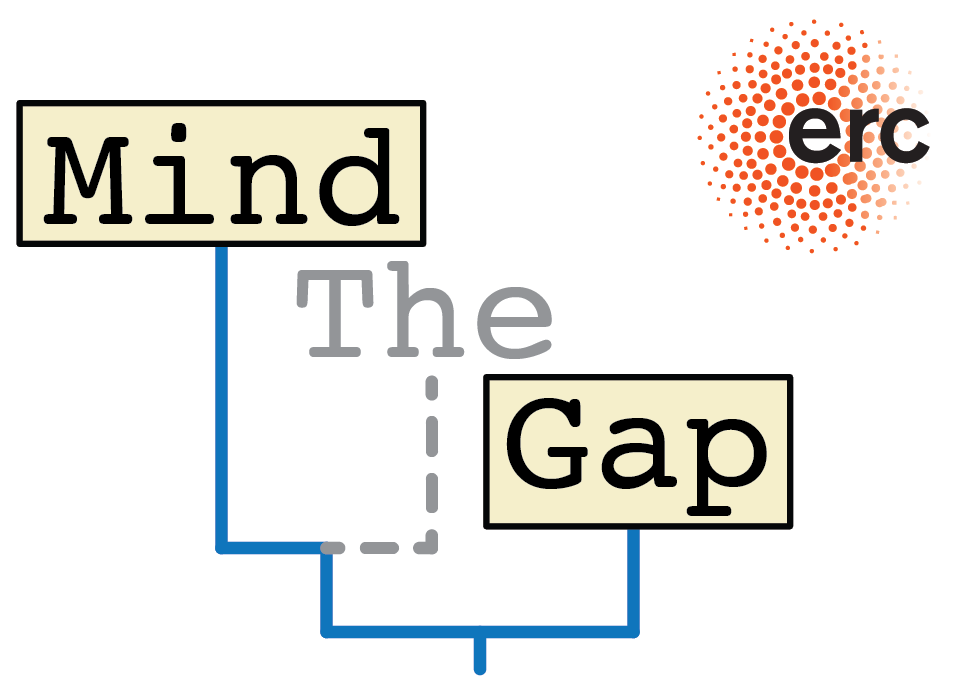

# DarwinCAT

## Description

App to visualize the effect of carbonate stratigraphy on trait evolution

## Authors

__Niklas Hohmann__ (Maintainer)  
Utrecht University  
email: n.hohmann@uu.nl  
Web page: [uu.nl/staff/NHohmann](uu.nl/staff/NHohmann)  
Orcid: [0000-0003-1559-1838](https://orcid.org/0000-0003-1559-1838)

__Emilia Jarochowska__  
Utrecht University  
email: e.b.jarochowska [at] uu.nl  
Web page: [uu.nl/staff/EBJarochowska](https://www.uu.nl/staff/EBJarochowska)  
Orcid: [0000-0001-8937-9405](https://orcid.org/0000-0001-8937-9405)

__Peter Burgess__, University of Liverpool  

## License

Apache 2.0 License, see LICENSE file for license text.

## Requirements

R version 3.0.2 or later  
R packages "shiny" and "png"

## Resources

The app uses datasets generated by [CarboCAT](https://github.com/csdms-contrib/carbocat), a forward model of carbonate sedimentation developed by [Peter Burgess](https://www.liverpool.ac.uk/environmental-sciences/staff/peter-burgess/). If you use or cite the app, please cite CarboCAT:

- Burgess, P.M., 2013, CarboCAT: A cellular automata model of heterogeneous carbonate strata: Computers & Geosciences, v. 53, p. 129–140, doi: [10.1016/j.cageo.2011.08.026](https://www.sciencedirect.com/science/article/pii/S0098300411002949).

## Offline Usage

Before usage, make sure the _shiny_ and the _png_ packages are installed and loaded by running the following in R:

``` R
if (!require("shiny")) install.packages("shiny")
if (!require("png")) install.packages("png")
```

Then set your working directory "DIR" to where the file "app.R" is located using

``` R
setwd("DIR")
```

Now you can start the app using the command

``` R
shiny::runApp()
```

## Online Usage

The app is available on [stratigraphicpaleobiology.shinyapps.io/DarwinCAT](https://stratigraphicpaleobiology.shinyapps.io/DarwinCAT/) - note this is still a beta version.

## Repository structure

- _LICENSE.md_ : Apache 2.0 license text
- _README.md_ : Readme file
- _data_ : Folder for data
  - _age_depth_models_for_shiny_app.Rdata_ : R workspace containing the age depth models generated by CarboCAT in Matlab
- _src_ : Folder for code
  - _global.R_ : loads data & global variables into workspace
  - _makeBasinTransectPlot.R_ : plot basin transect generated by CarboCAT
  - _makeWheelerDiagram.R_ : plot Wheeler diagram generated by CarboCAT
  - _makeTimeDomainPlot_no_gaps.R_ : plot trait simulations in time
  - _getAgeDepthModel.R_ : returns age depth models based on input
  - _getEvolutionarySimulations.R_ : makes evolutionary simulation based on inputs
  - _makeAgeDepthModelPlot.R_ : plots age depth models
  - _makeStratDomainPlot.R_ : plot evolutionary simulations in stratigraphic domain
  - _makeTimeDomainPlot.R_ : plot evolutionary simulation in time domain with options to mark removed time intervals
- _www_ : Folder with pictures used in the app  
  - _people_ : Folder with pictures of authors
  - _logos_ : Folder with logos
  - _geology_ : Folder with basin transect and wheeler diagram produced by CarboCAT  
- _app.R_ : Main app

## Funding

Online access to the App is made possible by the IDUB programme of the University of Warsaw (Grant BOB-IDUB-622-18/2022).  
Co-funded by the European Union (ERC, MindTheGap, StG project no 101041077). Views and opinions expressed are however those of the author(s) only and do not necessarily reflect those of the European Union or the European Research Council. Neither the European Union nor the granting authority can be held responsible for them.  

