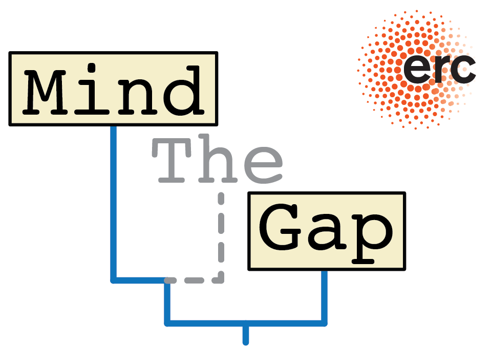

# DarwinCAT

App to visualize the effect of carbonate stratigraphy on trait evolution

## Authors

__Niklas Hohmann__  
Utrecht University  
email: n.hohmann@uu.nl  
Web page: [uu.nl/staff/NHohmann](uu.nl/staff/NHohmann)  
Orcid: [0000-0003-1559-1838](https://orcid.org/0000-0003-1559-1838)

__Emilia Jarochowska__, Utrecht University  
__Peter Burgess__, University of Liverpool  

## Requirements

R version 3.0.2  or later  
R package "shiny"

## Offline Usage

Before usage, make sure the shiny package is installed and loaded by running the following lines in R:

``` R
if (!require("shiny")) install.package("shiny")
```

Then set your working DIR to where the file "app.R" is located using

``` R
setwd(DIR)
```

Now you can start the app using the command

``` R
shiny::runApp()
```

## Online Usage

Coming soon

## Repository structure

- _data_ : Folder for data
  - _ageDepthModelsForShinyApp.Rdata_ : R workspace containing the age depth models generated by CarboCAT in Matlab
- _src_ : Folder for code
  - _global.R_ : loads data & global variables into workspace
  - _getAgeDepthModel.R_ : returns age depth models based on input
  - _getEvolutionarySimulations.R_ : makes evolutionary simulation based on inputs
  - _makeAgeDepthModelPlot.R_ : plots age depth models
  - _makeStratDomainPlot.R_ : plot evolutionary simulations in stratigraphic domain
  - _makeTimeDomainPlot.R_ : plot evolutionary simulation in time domain
- _www_ : Folder with pictures used in the app  
  - _people_ : Folder with pictures of authors
  - _logos_ : Folder with logos  
- _app.R_ : Start app
- _LICENSE.md_ : MIT license text
- _README.md_ : Readme file

## Funding

This app is part of the ERC project "MindTheGap", PI Emilia Jarochowska.  

